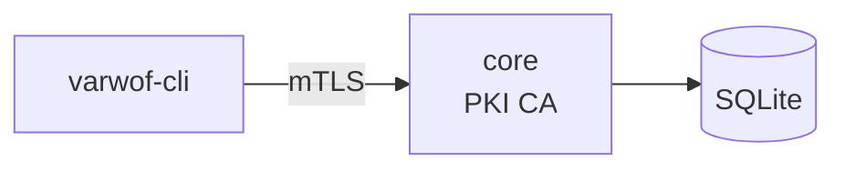

# varwof-cli

> CLI management tool — mTLS direct connection to core API for certificate issuance, revocation, renewal, and queries.

> ⚠️ **Preview** — Not for production use. APIs and features may change before official release.

[](LICENSE)
[](https://pkg.go.dev/github.com/varwof/client)

[中文](README_CN.md)

## What is varwof-cli?

Command-line management client for varwof PKI core. Connects to core API via mTLS for full certificate lifecycle management.

```
Request → varwof-cli ──mTLS──→ core API
```

## Quick Start

```bash
go build -o varwof-cli .

cat > config.json <<EOF
{
  "server": "https://127.0.0.1:4433",
  "ca_cert": "/etc/varwof/core/root/ca.pem",
  "client_cert": "/etc/varwof/core/keys/superadmin.pem",
  "client_key": "/etc/varwof/core/keys/superadmin-key.pem"
}
EOF

varwof-cli --config config.json issue \
  --cn server.example.com \
  --san "DNS:server.example.com,IP:10.0.0.1" \
  --profile tls-server

varwof-cli --config config.json cas
```

## Installation

```bash
go build -o varwof-cli .
```

## Commands

| Command | Description |
|---------|-------------|
| `issue` | Issue new certificate |
| `revoke` | Revoke certificate |
| `renew` | Renew certificate |
| `list` | List certificates/CAs |
| `cas` | View CA list |
| `find-by-key` | Find by public key |
| `re-sign` | Re-sign with original key |
| `revoke-by-principal` | Revoke by person |
| `revoke-subca` | Revoke by sub-CA |
| `batch` | Batch issuance |

## Ecosystem



client is the **management client** of the varwof ecosystem. This project is a member of the [Open Invention Network](https://openinventionnetwork.com/).

## Links

| | |
|---|---|
| Homepage | https://varwof.com |
| Community | https://varwof.org |
| IETF Draft | [draft-wei-aic-identity-cert](https://datatracker.ietf.org/doc/draft-wei-aic-identity-cert/) |
| License | Apache-2.0 |
| Member | [Open Invention Network](https://openinventionnetwork.com/) |
